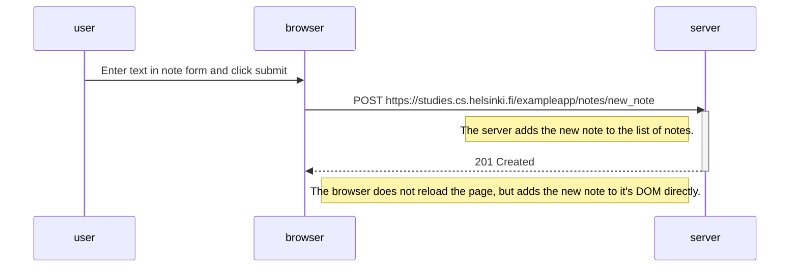

# New Note Diagram

```mermaid
sequenceDiagram
    participant user
    participant browser
    participant server

    user ->> browser: Enter text in note form and click submit
    browser ->> server: POST https://studies.cs.helsinki.fi/exampleapp/notes/new_note
    activate server
    Note left of server: The server adds the new note to the list of notes.

    server -->> browser: 201 Created
    deactivate server

    Note right of browser: The browser does not reload the page, but adds the new note to it's DOM directly.
```